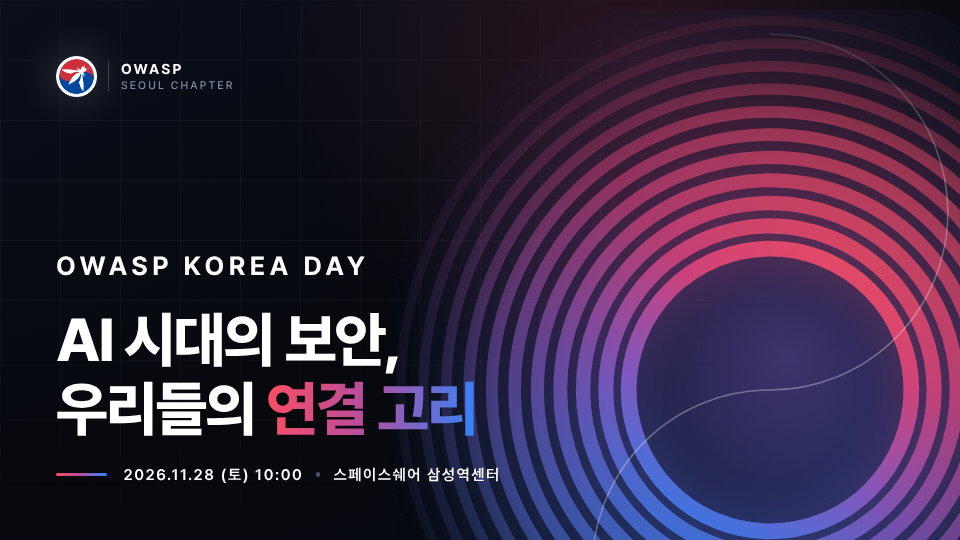

 

# OWASP Korea Day 2026
### AI 시대의 보안, 우리들의 연결 고리

  - **일시**: 2026년 11월 28일 (토) 10:00 ~ 18:00 (등록 09:30 시작)
  - **장소**: 스페이스쉐어 삼성역센터 (서울 강남구 영동대로96길 20 대화빌딩 B1F) — 2호선 삼성역 8번 출구 도보 2분
  - **공식 사이트**: [https://www.owaspkr.org/2026/](https://www.owaspkr.org/2026/){: target="_blank"}

---

## 소개

지식은 기계가 학습할 수 있지만, 경험은 나눌 때 가치가 생깁니다. 이번 OWASP Korea Day에서는 강해진 AI 시대의 위협을 함께 대비하기 위해 사람들을 연결하려고 합니다. 최신 정보를 공유하고 경험으로 쌓은 직관을 나눠 주세요. 오는 11월 28일, OWASP Korea Day 2026에서 사람을 만나고 다양한 경험들을 함께 공유해 보세요.

OWASP Seoul Chapter는 2011년부터 운영해 왔습니다. 2025년 5월 5기 운영진이 꾸려진 뒤로는 16회 이상의 월별 발표 세션과 12회 이상의 컨퍼런스를 통해 보안인들이 연결될 수 있는 자리를 꾸준히 만들어 왔습니다. 현재까지 아카이브된 발표는 총 43개이며, 모두 Past events 탭에서 확인하실 수 있습니다.

행사는 스페이스쉐어 삼성역센터 B1층 전체를 사용하며, 메인 세션(리젠시홀), 커뮤니티 세션(갤럭시홀), 핸즈온 랩(델피노홀), 커뮤니티·스폰서 부스(컨퍼런스 C룸)가 하루 동안 나란히 진행됩니다.

 

## 참석

  - 일반 참가 신청은 추후 오픈합니다. **11월 28일 하루만 미리 비워두세요.** 신청이 열리면 [공식 사이트](https://www.owaspkr.org/2026/){: target="_blank"}가 제일 먼저 바뀝니다.
  - 300명 이상 규모로 기획하고 있으며, 최대 500명까지 참여 가능한 공간을 운영할 예정입니다.
  - 등록은 09:30부터 B1층 대형 라운지의 등록 데스크에서 진행되며, 오프닝은 10:00입니다.
  - 캘린더에 미리 담아두기: [.ics 내려받기 (Apple · Outlook)](https://www.owaspkr.org/2026/events/calendar.ics){: target="_blank"}

 

## 기여

발표, 커뮤니티, 핸즈온 랩, 자원봉사, 스폰서. 다섯 가지 방법이 열려 있습니다.

| 트랙 | 내용 | 마감 | 신청 |
| --- | --- | --- | --- |
| CFP · 발표 제안 | 리젠시홀 메인 세션 8개 선정, 세션당 20~40분 (Q&A 포함) | 2026년 10월 18일 23:59 | [제안하기](https://sessionize.com/owaspseoul/){: target="_blank"} |
| CFC · 커뮤니티 모집 | 컨퍼런스 C룸 부스 + 갤럭시홀 오후 커뮤니티 세션장 운영 (지원 조건 없음) | 2026년 10월 4일 | [신청하기](https://forms.gle/pKnTiPBguiyctpKk8){: target="_blank"} |
| CFL · 핸즈온 랩 | 델피노홀 2시간 실습 세션, 오전(10:30) · 오후(14:00) 각 1회 | 추후 공지 | [제안하기](https://forms.gle/VUWJJ6ffQvNiCnn88){: target="_blank"} |
| CFV · 자원봉사 | 등록 데스크, 동선 안내, 세션 타임키핑, 촬영, 물품 관리 | 2026년 10월 4일 | [신청하기](https://forms.gle/yoakVeW9o4v4pnxx8){: target="_blank"} |
| CFS · 스폰서 | 200만원 / 100만원 / 50만원 3단계 (홍보 테이블 및 로고 노출) | 슬롯 소진 시 마감 (상시 접수) | [신청하기](https://forms.gle/HuDCdb5auQ35hP1M6){: target="_blank"} |

#### CFP 모집 주제
  - AI for Security, Security for AI — LLM 보안, AI를 활용한 공격 및 방어 전략, AI 안전성과 윤리
  - 커뮤니티 기여 — 보안 오픈소스 운영, 사내 세미나·워킹그룹·챕터 운영, 컨퍼런스 발표 및 콘텐츠 기여 경험
  - 보안 업무 자동화 — AI를 활용한 자동화, 반복적인 보안 운영 업무 자동화 사례
  - 애플리케이션 및 웹 보안 — OWASP Top 10, DevSecOps, 시큐어 코딩
  - 클라우드 & 인프라 보안 — Cloud Native Security, Zero Trust, IAM
  - 취약점 분석 및 리버싱 — 최신 취약점 연구, 익스플로잇, 위협 인텔리전스
  - 거버넌스 관점의 보안 — 비 IT 인력의 안전한 IT 자원 사용을 위한 시스템·문화·관리·교육적 접근
  - 커리어 · 조직 운영 · 리더십 — 보안 조직을 만들고 키운 이야기, 커리어 전환과 성장

발표자, 커뮤니티, 랩 진행자, 자원봉사자에게는 무료 참가권, 중식(도시락), 스태프 티셔츠, 네트워킹 애프터파티 초대 등의 혜택이 제공됩니다. 특정 제품·서비스를 직접 홍보하는 세션은 제한됩니다.

 

## 티켓

참가비는 대관과 운영에 그대로 쓰입니다. 부담 없이 오실 수 있도록 얼리버드를 두 차례 엽니다.

| 구분 | 가격 | 오픈 | 수량 |
| --- | --- | --- | --- |
| 1차 얼리버드 (50% 할인) | 5,000원 | 9월 15일 | 선착순 50장 |
| 2차 얼리버드 (20% 할인) | 8,000원 | 10월 15일 | 선착순 100장 |
| 일반 | 10,000원 | 얼리버드 소진 후 | - |

**현장 등록은 받지 않습니다. 사전 등록만 가능합니다.** 모든 비용은 행사에 사용되며 개인 및 특정 단체의 영리 목적으로 사용되지 않습니다.

  - 티켓 안내 자세히 보기: [https://www.owaspkr.org/2026/tickets/](https://www.owaspkr.org/2026/tickets/){: target="_blank"}

 

---

장소 안내와 당일 타임테이블을 포함한 더 자세한 내용은 공식 사이트에서 확인하실 수 있습니다.
### [https://www.owaspkr.org/2026/](https://www.owaspkr.org/2026/){: target="_blank"}

문의: [seoul-leaders@owasp.org](mailto:seoul-leaders@owasp.org)

 

#### OWASP Korea Day 2026 (English)
OWASP Korea Day 2026 will be held on **Saturday, November 28, 2026, 10:00-18:00** at SpaceShare Samseong Station Center (B1F, Daehwa Building, 20 Yeongdong-daero 96-gil, Gangnam-gu, Seoul), under the theme **"Security in the AI Era, Our Connection"**. The day brings together a main track in Regency Hall, community sessions, hands-on labs, and community & sponsor booths for 300+ attendees. Calls for papers, communities, labs, volunteers, and sponsors are open — see the table above for deadlines. Tickets start at KRW 5,000 (first early bird, opening September 15); on-site registration is not available. Full details: [https://www.owaspkr.org/2026/](https://www.owaspkr.org/2026/){: target="_blank"}

  
